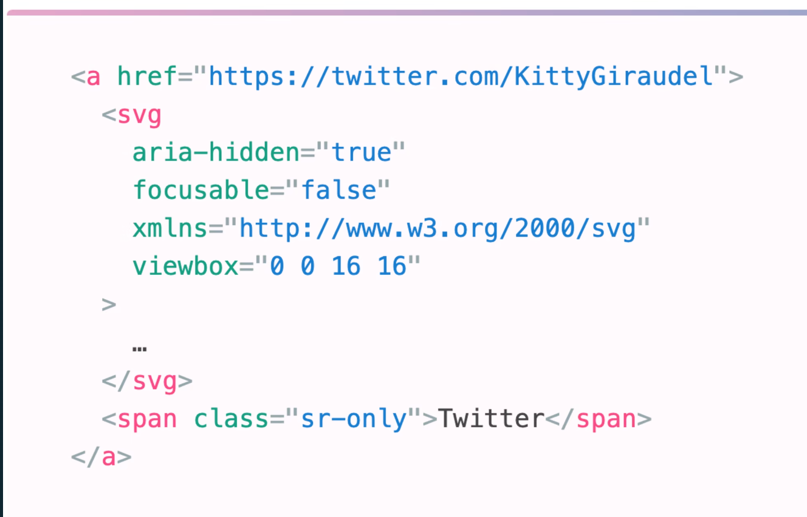
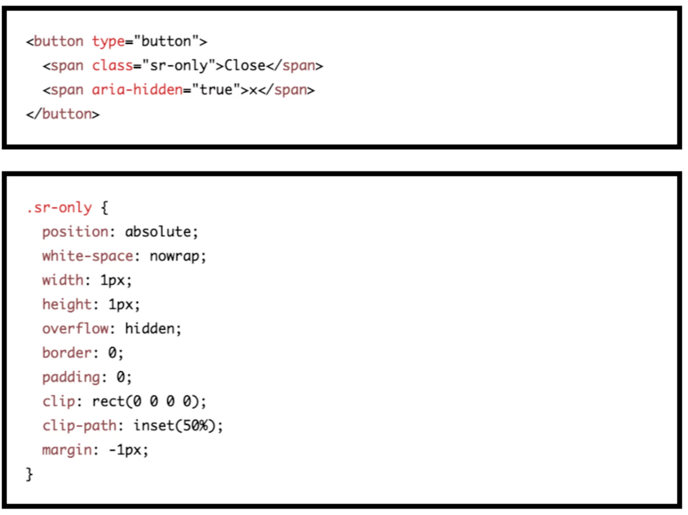

# HTML

## Accessibility

ARTICLE: https://www.smashingmagazine.com/2021/03/complete-guide-accessible-front-end-components/
PLAYLIST: https://www.youtube.com/playlist?list=PLNYkxOF6rcICWx0C9LVWWVqvHlYJyqw7g
COURSE: https://auth.udacity.com/sign-up?next=https://www.udacity.com/course/web-accessibility--ud891

### TEST:

---

**Web Accessibility Development Test**

**Instructions:** Select the most appropriate answer for each question.

1. What is the recommended method to associate a label with a form control?

   - a) Use a visual label that is hidden using CSS.
   - b) Use the WAI-ARIA attributes only.
   - c) Use the `for` attribute on the `<label>` element linked to the `id` attribute of the form element.
   - d) Labels are not necessary for form controls.

2. What is the purpose of alternative text for images?

   - a) To describe the appearance of the image in detail.
   - b) To hide the image from screen readers.
   - c) To provide a text alternative for informational and functional images.
   - d) Alternative text is not required for images.

3. How can the primary language of a web page be indicated?

   - a) Using the `aria-lang` attribute on the HTML tag.
   - b) Using the `lang` attribute on specific elements.
   - c) By embedding language metadata within the image files.
   - d) The primary language of a page does not need to be indicated.

4. Which markup element should be used to provide structure and meaning in HTML?

   - a) `
`
   - b) ``
   - c) `<table>`
   - d) Appropriate elements such as headings, lists, and tables.

5. How should errors be handled in web forms to assist users?

   - a) Errors should be intentionally obscure to challenge users.
   - b) Errors should not be highlighted to avoid confusion.
   - c) Provide clear instructions, error messages, and suggestions for corrections.
   - d) Users should be left to figure out errors on their own.

6. What should be considered when developing interactive elements for keyboard accessibility?

   - a) Keyboard access is not important for interactive elements.
   - b) Use tabindex="0" to add elements into the navigation order.
   - c) Only focus on mouse-based interactions for improved user experience.
   - d) Scripting is not necessary for keyboard support.

7. Why is it recommended to avoid CAPTCHA where possible?
   - a) CAPTCHA makes the website more secure.
   - b) CAPTCHA is easy to use for people with disabilities.
   - c) CAPTCHA creates problems for many people and has alternatives.
   - d) CAPTCHA is necessary for compliance with WCAG requirements.

### Accessibility Article:

https://www.smashingmagazine.com/2021/03/complete-guide-accessible-front-end-components/

#### :focus

where in document we are, removing outline is bad idea

:focus-within - styling of parent of focused element
:focus-visible - not show focus when interact with mouse pointer

#### autocomplete

#### link without text

link wrapping svg element and should be added aria-hidden

links - navigate
any other -> buttons

#### Disabled buttons

disabled buttons doesnt allow to complete form so
it doesnt work on focus
we should have message about what is wrong
and better approach is change disabled to aria-disabled
to allows to click on button and trigger again message

#### Close buttons

#### Checkboxes & RadioButtons

When hiding an interactive element, we need to make sure we choose a hiding technique that keeps it screen reader-accessible, position it on top of whatever is visually replacing it, so that a user navigating by touch can find it where they expect to, and then make it transparent.

#### Overlays and pop-ups

https://quentin-bellanger.com/blog/accessible-cookies-banner/

#### Current page navigation

aria-current, not only color but also we can use image

#### Dark mode
